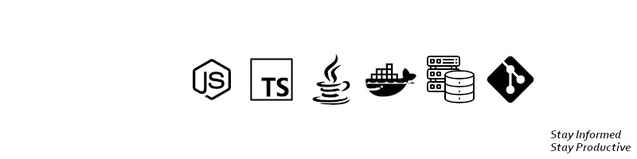

   

   <h1>Olá, seja muito bem-vindo(a) ao meu GitHub! 👋</h1>

   
Me chamo Alex e sou desenvolvedor Back-End (API REST) há quase 2 anos.
   Durante minha jornada como Dev, adquiri maior afinidade no lado servidor da força.
   Atualmente, estou estudando e aplicando inúmeros conceitos aos meus projetos, a fim de alcançar o meu melhor potencial e uma oportunidade no mercado de trabalho.

   <h3>Agradecimentos à <a href="https://www.linkedin.com/in/vitorhcs/">VITOR HUGO</a> (mentor), por dedicar seu tempo na revisão dos projetos e novas implementações.</h3>

   <h2>📂 Melhores Projetos</h2>
   <h3>1. <a href="https://github.com/AlexSnider/Aquila-Project">Aquila - Geo Sensors - TS 🚢</a></h3>
   <h3>2. <a href="https://github.com/AlexSnider/Projeto-API-e-commerce-Node.js">Minha Primeira API - JS 🥇</a></h3>
   <h3>3. <a href="https://github.com/AlexSnider/YoutubeTotalTime">YouTube Total Time 🚀</a></h3>

   <h2>🔧 Habilidades Técnicas</h2>
   
  
  
  
  
  
  
    
  

  <h2>Meu Histórico no GitHub</h2>
   
   

 

   <h1><a href="https://linktr.ee/techdev8">Contato 📧</a></h1>

   <h4>No matter how hard it may be, stay focused. 🎯</h4>

